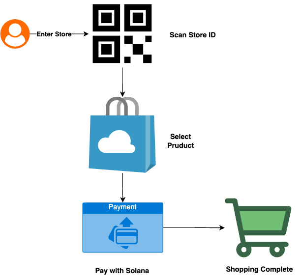

# SoDap - Solana Decentralized Shopping Platform

<div align="center">
  
  <h3>Decentralized E-Commerce Powered by Solana Blockchain</h3>
</div>

---

### 📖 Table of Contents
- [Overview](#-overview)
- [Key Features](#-key-features)
- [Blockchain Features](#-blockchain-features)
  - [Secure Store Management Using PDAs](#-secure-store-management-using-pdas)
  - [On-Chain Data](#-on-chain-data)
  - [Tested Functionalities (18 Passing Tests)](#-tested-functionalities-18-passing-tests)
- [Getting Started](#-getting-started)
- [Architecture](#-architecture)
- [Development](#-development)
- [Contributing](#-contributing)
- [License](#-license)

---

### 🌟 Overview

SoDap is a decentralized shopping platform powered by Solana blockchain. It aims to revolutionize in-store shopping by providing secure, transparent, and efficient shopping experiences for end users, store owners.

<div align="center">
  
  <p><em>SoDap Architecture Design</em></p>
</div>

---

### ✨ Key Features

#### 🔐 Secure Payment with Salana 
- payment and refund
- 

#### 🔐 Authentication & User Management
- Secure email/password  logins.
- Store and Store Admin Management

#### 🏪 Store Management
- Intuitive dashboard for store and  store admin management.
- Real-time updates for stock and sales.

#### 🛒 Shopping Experience
- Modern interface for browsing products.
- Comprehensive cart and order tracking features.

---

### 🛡️ Blockchain Features

#### 💸 Secure Store Management Using PDAs
- **Program Derived Addresses (PDAs)**: Each store has a unique PDA that acts as a secure on-chain identifier.
- **Store-Specific Lamport Vaults**: Funds are managed in deterministic lamport vaults tied to each store's PDA.
- **On-Chain Product Management**: Immutable product details and pricing are stored securely.
- **Escrow Payment System**: PDAs handle escrow payments, ensuring buyer and seller protection.

#### 🔗 On-Chain Data
- Immutable product and store data for transparency.
- Cryptographically secure transactions to ensure trust and reliability.

#### 🧪 Tested Functionalities (18 Passing Tests)

##### Admin Management
1. **Add Admin**: Authorized addition of new admin accounts
2. **Remove Admin**: Secure removal of admin privileges
3. **Admin Authorization**: Proper verification of admin privileges
4. **Unauthorized Admin Operations**: Correct rejection of unauthorized admin operations

##### User Wallet Management
5. **Create User Wallet**: Successful creation of new user wallets
6. **Wallet Verification**: Proper verification of wallet ownership
7. **Wallet Funding**: Automatic funding of test accounts with sufficient SOL

##### Store Management
8. **Register Store**: Creation of new stores with proper ownership
9. **Update Store Metadata**: Secure updating of store information
10. **Store Owner Verification**: Verification of store ownership for operations

##### Product Management
11. **Register Product**: Addition of new products to stores
12. **Update Product**: Modification of existing product details
13. **Deactivate Product**: Proper deactivation of products
14. **Unauthorized Product Updates**: Rejection of unauthorized product modifications

##### Payment Processing
15. **Purchase Products**: Successful purchase of products with proper escrow
16. **Release Funds**: Secure release of funds from escrow to store owner
17. **Process Refunds**: Proper handling of refund requests
18. **Insufficient Funds Handling**: Graceful handling of insufficient funds errors

---

### 🚀 Getting Started

#### Prerequisites:
- Node.js 18+ and npm/yarn.
- Solana Toolkit and wallet.
- Anchor Framework for program development.

#### Installation:
```bash
git clone https://github.com/tenrikut/sodap-mono.git
cd sodap-mono
npm install
```

#### Development:
- Use `npm run dev` for local development.
- Spin up local Solana validators using `solana-test-validator`.

---

### 🛠️ Architecture

#### Backend (Solana/Anchor)
- Each store is uniquely identified and managed via a PDA.
- Escrow accounts are tied to store PDAs for secure payments.
- Product and purchase data are stored on-chain using Rust-based Solana programs.

---

### 🛠️ Development

#### Scripts:
- `npm test` to run tests.
- `anchor deploy` for program deployment.

---

### 🤝 Contributing

1. Fork the repository.
2. Create feature branches.
3. Submit pull requests.

---

### 📄 License

This project is licensed under the MIT License.
